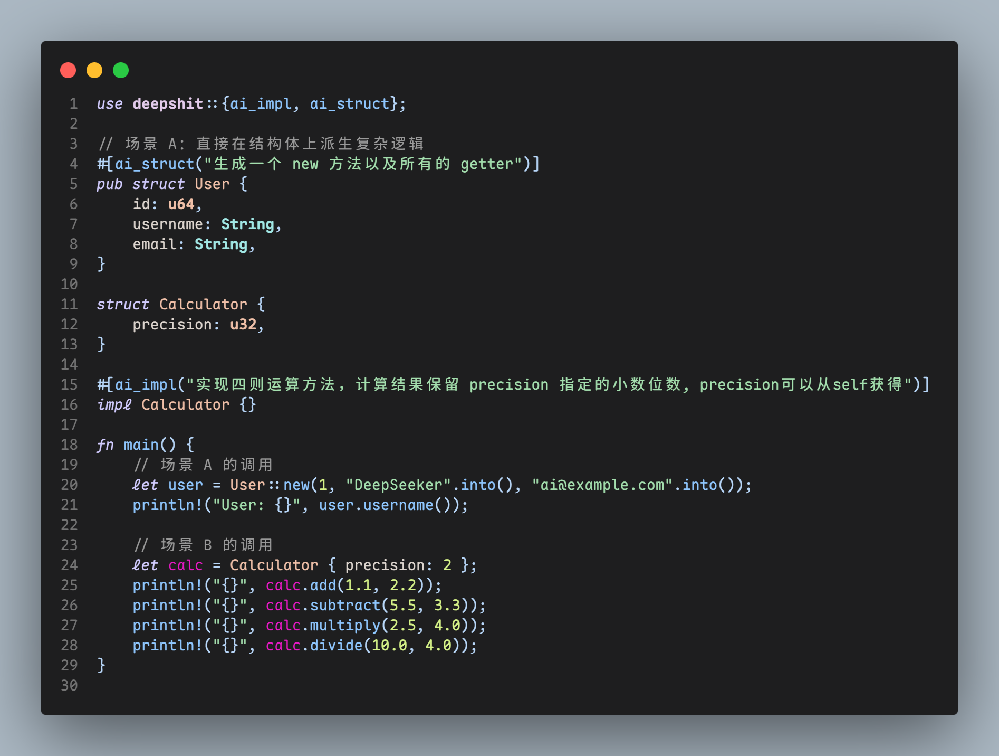
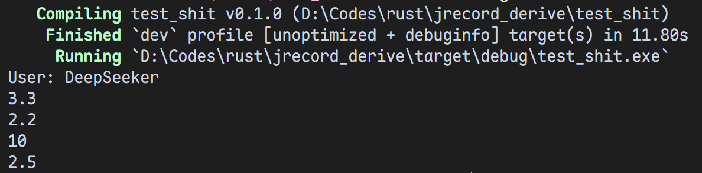

<div align="center">

# 🚀 DeepShit

**AI驱动的Rust派生宏框架**

[](https://www.rust-lang.org/)
[](LICENSE)
[](https://github.com/harkerhand/deepshit)


一个创新的Rust宏框架，使用AI能力自动生成结构体方法和impl块实现。通过自然语言描述，让编译器自动为你生成高质量的Rust代码。





[快速开始](#-快速开始) • [功能特性](#-核心功能) • [使用示例](#-使用示例) • [文档](./Readme.md)

</div>

---

## 📋 项目结构

```
DeepShit/
├── deepshit/          # 🔧 核心派生宏库
│   ├── Cargo.toml
│   └── src/lib.rs     # 宏定义和实现
├── test_shit/         # 📝 功能演示和测试
│   ├── Cargo.toml
│   └── src/main.rs    # 使用示例
└── Readme.md          # 📖 本文件
```

---

## ✨ 核心功能

### 1️⃣ `#[ai_struct]` 宏 - 自动生成结构体方法

在结构体上使用，通过自然语言描述自动生成相关方法。

**示例**：
```rust
#[ai_struct("生成一个 new 方法以及所有的 getter")]
pub struct User {
    id: u64,
    username: String,
    email: String,
}
```

**🎯 自动生成**：
- ✅ `new()` 构造方法
- ✅ `id()` 、`username()`、`email()` getter方法

### 2️⃣ `#[ai_impl]` 宏 - 自动生成impl块实现

在impl块上使用，通过自然语言描述自动生成方法实现。

**示例**：
```rust
struct Calculator {
    precision: u32,
}

#[ai_impl("实现四则运算方法，计算结果保留 precision 指定的小数位数")]
impl Calculator {}
```

**🎯 自动生成**：
- ✅ `add()` - 加法
- ✅ `subtract()` - 减法
- ✅ `multiply()` - 乘法
- ✅ `divide()` - 除法

---

## 📚 使用示例

### 输入代码
```rust
use deepshit::{ai_impl, ai_struct};

#[ai_struct("生成一个 new 方法以及所有的 getter")]
pub struct User {
    id: u64,
    username: String,
    email: String,
}

struct Calculator {
    precision: u32,
}

#[ai_impl("实现四则运算方法，计算结果保留 precision 指定的小数位数")]
impl Calculator {}

fn main() {
    let user = User::new(1, "DeepSeeker".into(), "ai@example.com".into());
    println!("User: {}", user.username());

    let calc = Calculator { precision: 2 };
    println!("{}", calc.add(1.1, 2.2));           // 3.3
    println!("{}", calc.subtract(5.5, 3.3));      // 2.2
    println!("{}", calc.multiply(2.5, 4.0));      // 10
    println!("{}", calc.divide(10.0, 4.0));       // 2.5
}
```

### 输出结果 🎉
```
User: DeepSeeker
3.3
2.2
10
2.5
```

---

## 🏗️ 技术设计

### 🔄 宏工作流程

```
┌─────────────────────────────────────────────┐
│            自然语言描述                      │
└────────────────────┬────────────────────────┘
                     ↓
        ┌────────────────────────────┐
        │  1️⃣ AST解析                  │
        │  2️⃣ 提示生成                 │
        └────────────────┬────────────┘
                         ↓
        ┌────────────────────────────┐
        │  3️⃣ AI代码生成              │
        └────────────────┬────────────┘
                         ↓
        ┌────────────────────────────┐
        │  4️⃣ 代码合成                │
        │  5️⃣ 编译验证                │
        └────────────────┬────────────┘
                         ↓
┌─────────────────────────────────────────────┐
│         高质量 Rust 代码                    │
└─────────────────────────────────────────────┘
```

### 🎯 核心保证

| 特性 | 说明 |
|------|------|
| 🔒 **类型安全** | 所有生成的代码都经过Rust编译器验证 |
| ⚡ **零开销** | 宏在编译时展开，运行时无任何额外成本 |
| 💬 **自然语言** | 开发者用自然语言描述需求，无需手动编写模板代码 |
| 🎨 **高度灵活** | 支持复杂逻辑描述，如precision参数的精度控制 |

## 🚀 快速开始

### 📋 前置要求

- 🦀 Rust 1.70+ (支持最新的宏特性)
- 📦 Cargo
- 🔑 DeepSeek API 密钥（或其他兼容的 API 服务）

### 🔧 环境变量配置

框架支持通过环境变量配置 API 相关参数：

| 环境变量 | 说明 | 默认值 | 必需 |
|---------|------|--------|------|
| `API_KEY` | API 密钥/令牌 | 无 | ✅ 是 |
| `API_BASE_URL` | API 服务地址 | `https://api.deepseek.com` | ❌ 否 |
| `MODEL` | 使用的 AI 模型 | `deepseek-chat` | ❌ 否 |

**配置示例**：

```bash
# Linux/macOS
export API_KEY="your-api-key"
export API_BASE_URL="https://api.deepseek.com"
export MODEL="deepseek-chat"

# Windows PowerShell
$env:API_KEY="your-api-key"
$env:API_BASE_URL="https://api.deepseek.com"
$env:MODEL="deepseek-chat"
```

### 💻 构建和运行

```bash
# 进入test_shit目录
cd test_shit

# 配置环境变量后运行演示
cargo run
```

---

## 💼 应用场景

| 场景 | 描述 |
|------|------|
| 🏗️ **快速原型开发** | 快速生成样板代码，专注业务逻辑 |
| 🗄️ **CRUD操作** | 自动为数据模型生成getter/setter |
| 🔢 **数学计算** | 生成带精度控制的算术运算 |
| 🌐 **API客户端** | 自动生成请求/响应处理方法 |
| 📦 **序列化/反序列化** | 自动为复杂类型生成转换方法 |

---

## 🌟 项目优势

| 特性 | 优势 |
|------|------|
| ✈️ **开发效率** | 减少60%+的模板代码编写 |
| 🎯 **代码质量** | AI生成的代码经过编译验证 |
| 🎨 **灵活性** | 自然语言描述，支持复杂逻辑 |
| 🔍 **可维护性** | 代码生成过程透明，易于调试 |
| ⚡ **性能优势** | 零运行时开销，性能无损失 |

---

## 📖 文档

- 📘 [项目结构详解](./Readme.md)
- 🔧 [API 参考](./deepshit/src/lib.rs)
- 📝 [使用示例](./test_shit/src/main.rs)

---

## 🤝 贡献

欢迎提交 Issue 和 Pull Request！

---

## 👨‍💻 关于

此项目展示了 **Rust 过程宏** 与 **AI 技术**结合的强大潜力，为自动化代码生成领域开辟了新的方向。

---

## 📄 许可证

本项目采用 MIT 许可证。详见 [LICENSE](LICENSE)

<div align="center">

**⭐ 如果这个项目对你有帮助，请给个 Star！ ⭐**

</div>
